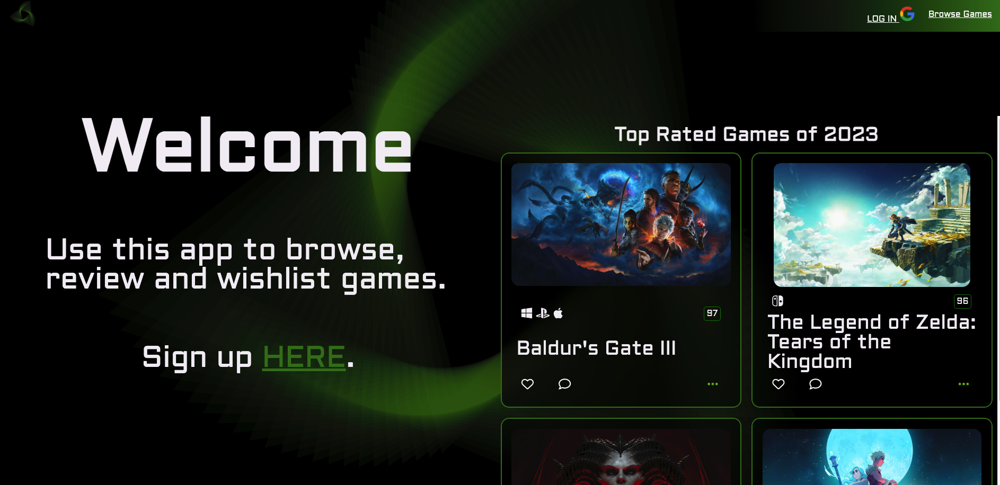
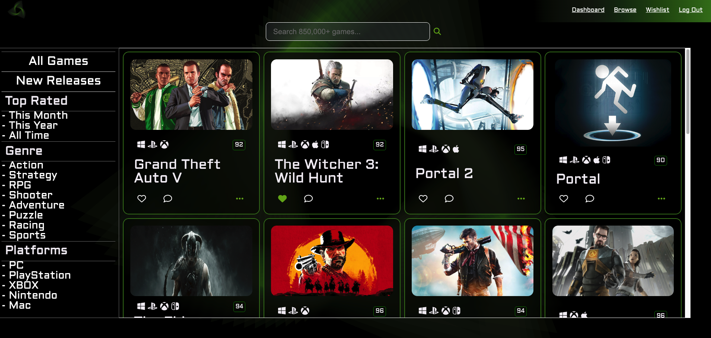
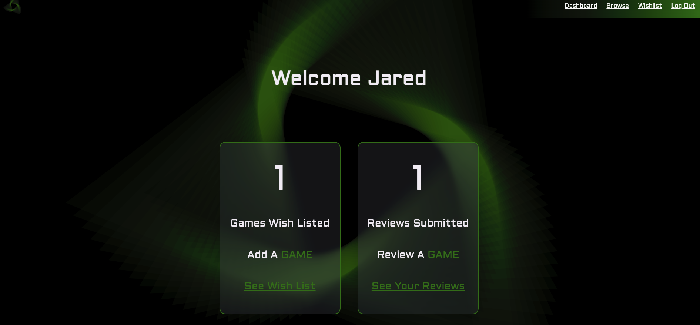

# Video-Game Wish-List(VGW)

Using the [RAWG api](https://rawg.io), VGW allows users to search over 800,000 games, add games to their wish list and review games. Each game has screen shots, ratings, details and more.

## Screen Shots

## Tech Stack

- JavaScript
- EJS
- CSS
- API

## Getting Started

Simply click on the link and sign in, browse games, wishlist them usin the little hear, go to your wishlist page and review the games. You can remove reviews and wishlisted games from their respective pages.

## Next Steps

- I still need to add more functionality around the api search, such as using the buttons on the side to refine the search parameters.

- Add a games details page when users click on the elipsis on the game card.

- Add functionality to see if other users have wishlisted or reviewed a game.

- Refine the responsive design
